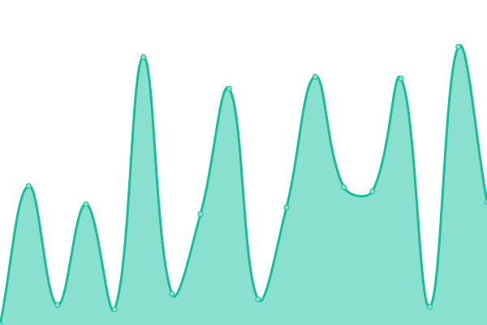

# [📈 Live Status](https://monitor.profusion.cc): <!--live status--> **🟧 Partial outage**

This repository contains the open-source uptime monitor and status page for [ProFusion-rune](https://monitor.profusion.cc), powered by [Upptime](https://github.com/upptime/upptime).

With [Upptime](https://upptime.js.org), you can get your own unlimited and free uptime monitor and status page, powered entirely by a GitHub repository. We use [Issues](https://github.com/ProFusion-rune/profusion-upptime/issues) as incident reports, [Actions](https://github.com/ProFusion-rune/profusion-upptime/actions) as uptime monitors, and [Pages](https://monitor.profusion.cc) for the status page.

<!--start: status pages-->
<!-- This summary is generated by Upptime (https://github.com/upptime/upptime) -->
<!-- Do not edit this manually, your changes will be overwritten -->
<!-- prettier-ignore -->
| URL | Status | History | Response Time | Uptime |
| --- | ------ | ------- | ------------- | ------ |
|  [rune](https://rune.red) | 🟥 Down | [rune.yml](https://github.com/ProFusion-rune/profusion-upptime/commits/HEAD/history/rune.yml) | 

 975ms
     
 | 

<a href="https://monitor.profusion.cc/history/rune">98.49%</a>
    

|  [profusion](https://profusion.cc) | 🟥 Down | [profusion.yml](https://github.com/ProFusion-rune/profusion-upptime/commits/HEAD/history/profusion.yml) | 

 693ms
     
 | 

<a href="https://monitor.profusion.cc/history/profusion">98.49%</a>
    

|  [jameshanlondirector.com](https://jameshanlondirector.com) | 🟥 Down | [jameshanlondirector-com.yml](https://github.com/ProFusion-rune/profusion-upptime/commits/HEAD/history/jameshanlondirector-com.yml) | 

 850ms
     
 | 

<a href="https://monitor.profusion.cc/history/jameshanlondirector-com">98.49%</a>
    

|  [Quarter Finance](https://quarterfinance.com) | 🟥 Down | [quarter-finance.yml](https://github.com/ProFusion-rune/profusion-upptime/commits/HEAD/history/quarter-finance.yml) | 

 985ms
     
 | 

<a href="https://monitor.profusion.cc/history/quarter-finance">98.49%</a>
    

|  [myPolitics](https://mypolitics.co) | 🟥 Down | [my-politics.yml](https://github.com/ProFusion-rune/profusion-upptime/commits/HEAD/history/my-politics.yml) | 

 1167ms
     
 | 

<a href="https://monitor.profusion.cc/history/my-politics">98.49%</a>
    

|  [BSSilberman](https://bssilberman.com) | 🟥 Down | [bs-silberman.yml](https://github.com/ProFusion-rune/profusion-upptime/commits/HEAD/history/bs-silberman.yml) | 

 585ms
     
 | 

<a href="https://monitor.profusion.cc/history/bs-silberman">98.49%</a>
    

|  [Google](https://google.com) | 🟩 Up | [google.yml](https://github.com/ProFusion-rune/profusion-upptime/commits/HEAD/history/google.yml) | 

 764ms
     
 | 

<a href="https://monitor.profusion.cc/history/google">99.65%</a>
    

<!--end: status pages-->

[**Visit our status website →**](https://monitor.profusion.cc)

## 📄 License

- Powered by: [Upptime](https://github.com/upptime/upptime)
- Code: [MIT](./LICENSE) © [Anand Chowdhary](https://anandchowdhary.com), supported by [Pabio](https://pabio.com)
- Data in the `./history` directory: [Open Database License](https://opendatacommons.org/licenses/odbl/1-0/)
